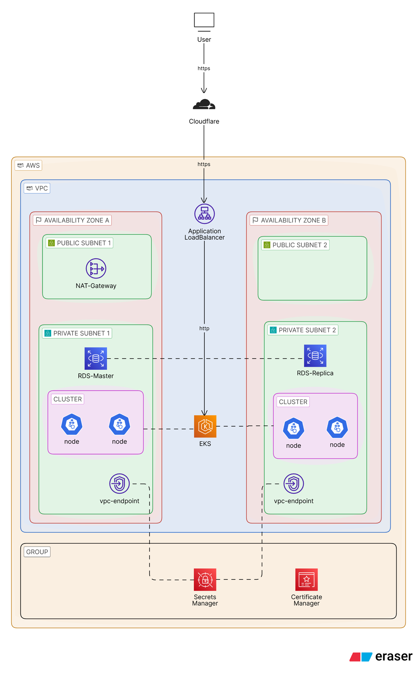

# AWS EKS Stack

This directory contains the AWS foundation for the project.

Terraform provisions the base infrastructure in the `base` workspace, then companion configurations in `rds/` and `k8s/` extend that foundation with the database layer and Kubernetes add-ons.

## What this stack provisions

- A VPC with public and private subnets across two Availability Zones
- An Amazon EKS cluster with a managed node group
- A public EKS endpoint so `kubectl` can be used from a local notebook
- AWS IAM access for the SSO administrator role
- Cloudflare-driven DNS and ingress integration
- ArgoCD bootstrap for GitOps-based workload delivery
- A separate PostgreSQL database workflow under `rds/`

## Architecture at a glance



The diagram below gives a compact view of the AWS environment:

- VPC segmentation
- public and private subnet placement
- EKS control plane access
- worker node placement
- supporting services such as RDS, Secrets Manager, ACM, and DNS

## Directory layout

- [main.tf](main.tf): VPC and EKS foundation
- [provider.tf](provider.tf): Terraform Cloud backend and providers
- [variables.tf](variables.tf): inputs for AWS, Cloudflare, and ArgoCD bootstrap
- [outputs.tf](outputs.tf): values exposed after apply
- [rds/](rds): PostgreSQL workspace built on top of the base cluster and VPC
- [k8s/](k8s): EKS add-ons, ArgoCD, and Kubernetes bootstrap resources

## GitOps and Kubernetes add-ons

The `k8s/` folder bootstraps the cluster add-ons that support workload delivery:

- ArgoCD
- ExternalDNS
- AWS Load Balancer Controller
- Metrics Server

Application stacks such as Kubecost and the Prometheus / Grafana / Loki monitoring stack are managed from a separate ArgoCD repository. This keeps the infrastructure layer here and the application layer in GitOps cleanly separated.

## Prerequisites

- AWS access with permission to create VPC, EKS, IAM, and related resources
- Terraform Cloud access for the `base` workspace used by this project
- A Cloudflare account, zone ID, and API token
- A GitHub personal access token if the ArgoCD repo is private
- A local notebook or workstation for `kubectl` access after the cluster is created

## Required inputs

Set these variables before applying:

- `region`
- `cloudflare_api_token`
- `domain_name`
- `cloudflare_zone_id`

For the RDS workspace, also provide:

- `db_username`
- `db_name`
- `db_port`

For ArgoCD bootstrap, also provide:

- `repoURL`
- `github_username`
- `github_token`

## Suggested deployment order

1. Apply the base workspace from this directory.
2. Apply `rds/` if you want the database layer.
3. Apply `k8s/` to bootstrap ArgoCD and the cluster add-ons.

## Accessing the cluster

After the base workspace is applied, update your kubeconfig from your local notebook:

```bash
aws eks --region $(terraform output -raw region) update-kubeconfig \
    --name $(terraform output -raw cluster_name)
```

Then verify access:

```bash
kubectl config get-contexts
kubectl get nodes
```

## Useful outputs

- `region`
- `vpc_id`
- `private_subnet_ids`
- `cluster_name`
- `cluster_endpoint`
- `cluster_version`
- `oidc_provider`
- `oidc_provider_arn`
- `cluster_security_group_id`
- `node_security_group_id`

## Notes

- The cluster endpoint is intentionally public so local `kubectl` access stays simple.
- The cluster uses managed node groups with SPOT capacity for cost control.
- The README in the repository root is the best starting point if you want the high-level project view.
